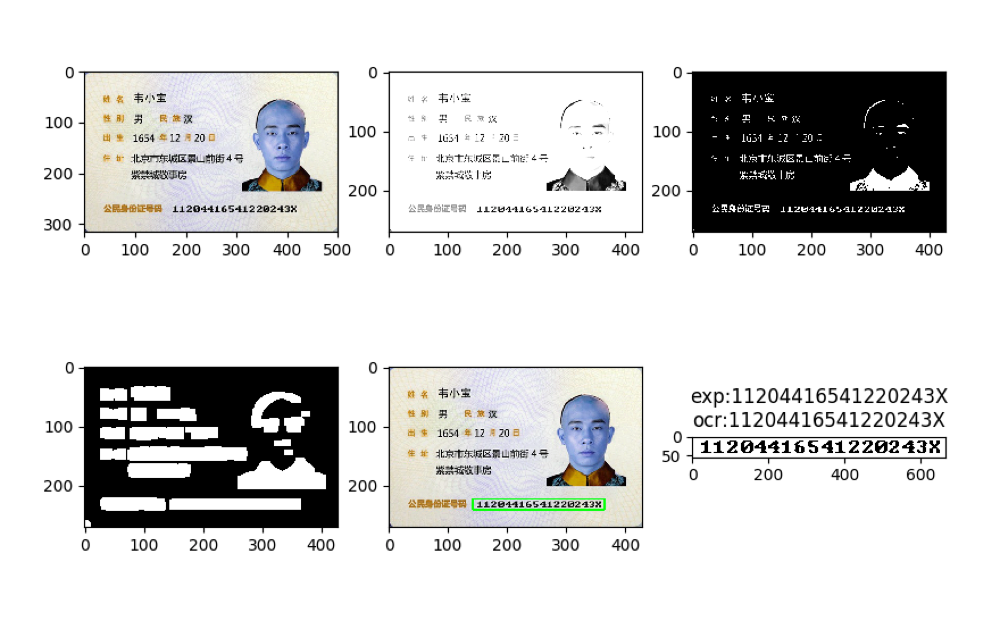

Card-Ocr
==========
身份证识别OCR, 从身份证图片中自动提取身份证号。
测试图片来自百度搜索的样例图片。
找到的图片比较少，目前都能正确识别。
可用的数据集个人很难找到。

# 依赖
* opencv
* pytesseract
* numpy
* matplotlib

# 流程
* 获取身份证号区域

image-》灰度=》反色=》膨胀=》findContours

* 数字识别

采用tesseract识别，通过trainfont.py获得traineddata.

# trainfont使用

 1. 通过autoBox = 1自动生成box文件
```
trainFont(fontName, fontPath, fontsize, txt, "eng", 0, autoBox=1)
```

 2. 通过jBoxEditor之类的修正box文件
 3. autoBox = 0 生成traineddata
```
 trainFont(fontName, fontPath, fontsize, txt, "eng", 0, autoBox=0)
```

# 识别
 获取到身份证区域之后，截取身份证号，灰度化，然后交给pytesseract
```
 pytesseract.image_to_string(image, lang='ocrb', config=tessdata_dir_config)
```

# 效果




# TODO
- [ ] Keras with Tesorflow 来训练识别


# 引用
* https://github.com/JinpengLI/deep_ocr/
* http://blog.csdn.net/zhangxb35/article/details/47979939
